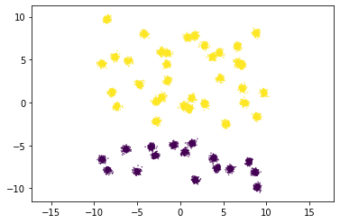
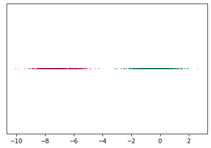

# 2D_clustering
## Overview
Groups 2D data into clusters.
## Details

Creates 2 clusters from 2D data

1. X-Axis
- Sort the points by x-values
- Find all of the values of the distances between points in the x dimension
- Find the largest gap

2. Y-Axis
- Sort the points by y-values
- Find all of the values of the distances between points in the y dimension
- Find the largest gap

3. Finishing
- Find the largest gap between the two sorts
- Define the clusters on that axis

# 1D_clustering
## Overview
Groups 1D data into clusters
## Details

Creates 2 clusters from 1D data

- find all of the values of the distances between points
- find the largest gap

